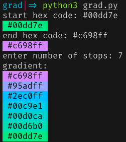

# Gradient Thing
Hey,

It's been a while. How are you doing today?

This is a super short Python script that makes nice perceptually uniform gradients for you. Running it is pretty simple:

1. Make sure you have `python3` installed.
2. Use `python3 -m pip install hsluv` to install `hsluv`, a dependency
3. Use `python3 grad.py` to run the program.

The program should prompt you for input. Follow the steps, and you'll get a nice list of colors to work with.

Known limitations: can only specify start and end steps. Do I care? ¯\_(ツ)_/¯

Here's a screenshot:

Anyway, have a nice day.

Sincerely,
Isaac Clayton
